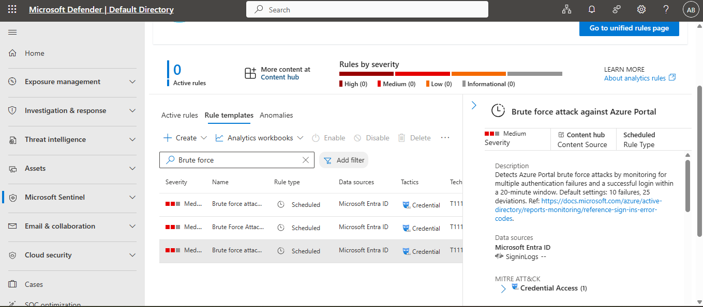
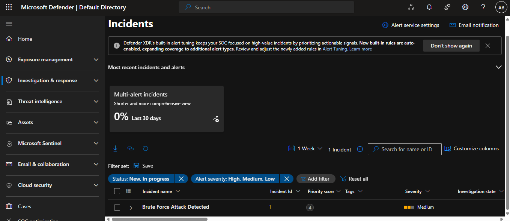

# Cloud SOC Lab: Threat Detection & Investigation with Microsoft Sentinel 🛡️☁️

## Project Overview
This project demonstrates a hands-on implementation of **Microsoft Sentinel (SIEM)** to detect, investigate, and report a simulated **Brute Force Attack** in a Microsoft Azure environment. The lab covers the entire incident lifecycle, from log ingestion to forensic analysis and reporting.

## Key Features
* **SIEM Deployment:** Configured Microsoft Sentinel on a Log Analytics Workspace.
* **Log Ingestion:** Integrated **Microsoft Entra ID** (Azure AD) via Diagnostic Settings.
* **Proactive Monitoring:** Enabled Analytics Rules to monitor for multiple failed authentication attempts.
* **Incident Investigation:** Analyzed high-fidelity alerts to identify attacker origin and target.
* **Reporting:** Generated a professional security incident report (PDF).

## Technologies Used
* **Platform:** Microsoft Azure
* **SIEM:** Microsoft Sentinel
* **Identity:** Microsoft Entra ID (Azure AD)
* **Query Language:** KQL (Kusto Query Language)
* **Tools:** Microsoft Defender for Cloud

## Lab Steps & Evidence

### 1. Detection Rule Configuration
Configured Analytics Rules to detect suspicious sign-in patterns.

### 2. Incident Triggered
Once the simulated Brute Force attack occurred, Sentinel successfully created **Incident ID: 1** with a **Medium** severity level.

### 3. Deep-Dive Investigation (Log Analysis)
Using Entra ID Sign-in logs, I successfully identified the Attacker's details:
* **Attacker IP:** `124.43.23.63` / `112.134.246.47`
* **Geolocation:** Colombo, Sri Lanka
* **Target Account:** [Your User Email]

### 4. Professional Reporting
A comprehensive security report was generated to document the attack story and impact.
📄  👉 **[Download Full Incident Report (PDF)](./Reports/Incident_1.pdf)** 

## Key Findings
* **Ingestion Delay:** Observed the real-world challenge of log ingestion latency between Entra ID and Sentinel.
* **Contextual Analysis:** Sentinel's "Attack Story" provided a clear visual representation of the threat actor's activity.
* **Security Posture:** Hardening identity via MFA or Conditional Access is recommended based on the attack patterns observed.

---
*Developed as part of the AZ-500: Azure Security Technologies certification journey.*
